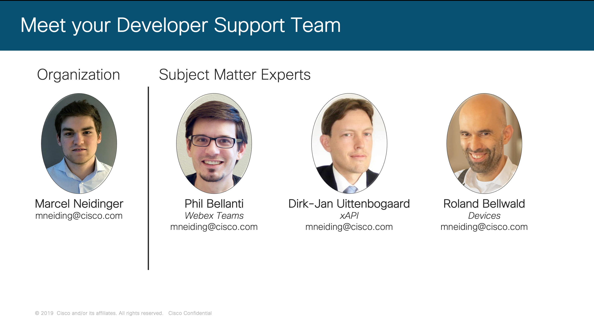
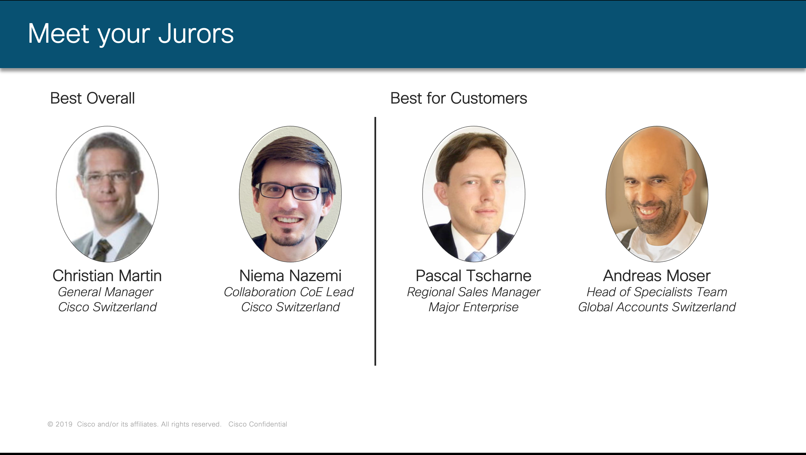
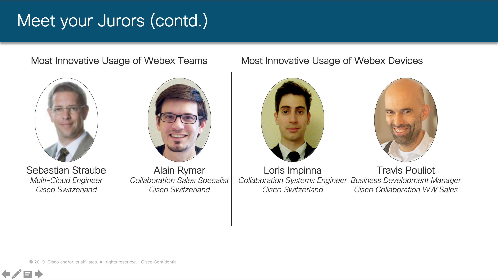

# Disrupt Collaboration Hackathon Developer Guide #

Welcome to the Disrupt Collaboration Summit 2019 and welcome at Cisco Switzerland. In this repository, you will find additional information around the hackathon that will be held during the Disrupt Collaboration Summit.

This event brings together developers from partners, customers, and Cisco to hack on Cisco Collaboration technologies for 24 hours. We are beyond excited to see what you can come up with. To facilitate boot-up please read the material provided below. If you have questions feel free to contact Marcel(mneiding@cisco.com) at any time.

The goal of the hackathon is to think about the next steps in collaboration. The Disrupt Collaboration Challange is about everything collaboration related. Would you like to improve the meeting experience? Or rather help teams find information quicker by writing a Webex bot? Possibilities are endless and we will provide you with the tools and knowledge needed to execute on this idea.

## Before the Event ##

Here is a checklist of things that you should do prior to the event.

- Make sure you have your lap top with you
- If you don't already have one please create a [Webex Teams](teams.webex.com) account (it's free) **using the email you used during registration**
- Check the list of resources available below

## Cisco Support Team ##

Feeling overwhelmed by all the available technologies? Don't worry we brought Subject Matter Experts (SMEs) on site to help you with all questions that may arise.

## Prices and Award Categories ##

No hackathon without a competition. During the Disrupt Collaboration Hackathon you'll have the ability to win prizes in four different categories:

* **Best Overall**
* **Best for Customers**
* **Most Innovative Usage of Webex Devices**
* **Most Innovative Usage of Webex Teams**

Also there would be no prices without a jury.

Please note that the prices are independent of each other: One team can win multiple prices.

## Available Technologies ##

During this hackathon, you will have the ability to work with the latest collaboration technology from Cisco.

Your Lab Kit will include:

* A [Cisco RoomKit Mini Video Endpoint](todo)
* A [Cisco DX80 Video Endpoint](todo)
* A [Webex Board 55" or 70"](todo)

We also have the [Webex Teams API](https://developer.webex.com) and [xAPI](https://developer.cisco.com/site/roomdevices/) for our Collaboration endpoints. Below you can find a quick primer and some interesting resources for both APIs.

### Webex Teams API Primer ###
Webex Teams is a chat and collaboration platform offered by Cisco. The platform offers end-to-end encrypted direct and group messaging as well as video calling. 

Probably most relevant for you: All features of Webex Teams are exposed via a RESTful API and a variety of SDKs. 

To get started with Webex Teams
* Sign up for a [Webex Teams account](https://teams.webex.com)
* [optional] Get a [desktop client](https://www.webex.com/team-collaboration.html)
* Log into [developer.webex.com](https://developer.webex.com) to view the API documentation

Here are a few learning resources you might find useful

* A [step-by-step introduction](https://developer.cisco.com/learning/tracks/collab-cloud) into the Webex Teams API
* The [awesome-webex](https://github.com/CiscoDevNet/awesome-webex) repository containing a bunch of examples
* Have a look at the [iOS](https://developer.webex.com/docs/sdks/ios), [android](https://developer.webex.com/docs/sdks/android), [browser](https://developer.webex.com/docs/sdks/browser), [node.js](https://developer.webex.com/docs/sdks/node), [java](https://developer.webex.com/docs/sdks/java) or [python](http://webexteamssdk.readthedocs.io/) SDKs

### xAPI Primer ###

TBD
